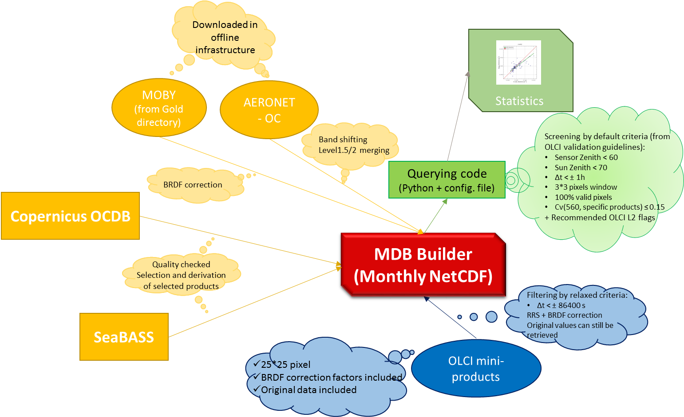

# Matchup Database files
Matchups Database (MDB) netCDF files, including matchups between OLCI and _in situ_ data from AERONET-OC network, MOBY buoy or downloaded from Copernicus OCDB or NASA SeaBASS Databases.

MDB files are provided through FTP, directly accesible from the Copernicus OCDB webpage.

For AERONET-OC and MOBY they are organised by site and updated on a monthly basis. Please refer to MDB attributes 'creation_date' and 'version'  to check which is the latest version available (only the latest version is available at FTP site).

For _in-situ_ data downloaded from OCDB or SeaBASS, they are organised by products.

A short description of the content as well as the format follows.

## MDB files content
Each MDB file contains: 

- All OLCI level-2 or Level-1 Full Resolution products, **25x25 pixels** centered on site/measurement point

- For Level-2 MDB only: **Fully normalized** OLCI Remote Sensing Reflectance (Rrs) values up to 709 nm 

- For Level-2 MDB only: BRDF factors provided to retrieve original directional reflectance of OLCI products

- _In-situ_ measurements available for each point/site within **24 hours** OLCI acquisition

- For AERONET-OC MDB only: all original Version 3 data from AERONET-OC network

- For MOBY MDB only: all original data from MOBY Gold directory (both, when available, from top and middle arms and from top and bottom arms measurements)

- Fully normalized _in-situ_ Rrs at OLCI nominal bands obtained through **band-shifting** (when Δλ>1 in the visible) and BRDF correction, when not applied already at source

- _in-situ_ measurements for cruises (chlorophyll HPLC or TSM or ADG443 or KD490 or Rrs or selected fluorometrically/spectrophotometrically derived chl-a), quality checked and optically weighted in case of profiles

Note that MDB content is **extended** beyond the data required for the baseline validations. The goal is to facilitate any additional investigation.
Users have to apply their own analyses to extract matchups, that are not screened neither for pixel validity nor applying any other criteria than the 24 hour time difference limit.
For baseline validations, the **recommended matchup protocols** should be followed.

## MDB files naming convention
Each MDB file is named using the following template:
MDB [SATELLITE] [SENSOR] [LEVEL] [TYPE] [SITE].nc
where:
- SATELLITE: S3A or S3B
- SENSOR: OLCI
- LEVEL indicates OLCI products level: 'L1' for EFR products or 'L2' for WFR products
- TYPE indicates _in-situ_ data type: 'AERONET', 'MOBY', 'HPLC' (for chlorophyll HPLC measurements only), 'KD490', 'TSM', 'ADG', or CHL (for fluorometrically/spectrophotometrically derived chl-a) 
- SITE (for AERONET-OC MDB only) indicates AERONET-OC site

## MDB files preparation
Monthly, MDB files are genereted through a Python module (called MDB_Builder).

The diagram below shows at high level the workflow followed in order to build MDB files.



### Preparing OLCI data
OLCI Level-1 and Level-2 FR NTC products are systematically extracted over AERONET-OC sites and MOBY position (the second one, updated on a daily basis), stored as a single NetCDF files (one for each extraction).
The extraction is also performed occasionally, based on _in-situ_ measurement time and location, derived from SeaBASS and Copernicus OCDB Databases.
If for an extraction exists at least one _in-situ_ measurement within 24 hours before and after its acquisition time, the extraction is included in the MDB.
NetCDF files contain all the original products excepted for, for Level-2 MDB files, water reflectance, converted into Rrs, after BRDF correction for the first 11 bands. BRDF factors are retrieved using the same algorithm implemented in OLCI Level-2 Ocean Colour algorithm (chlorophyll concentration based), using Look-Up Tables (LUTs) provided in S3A Ocean colour parameters (OCP) Auxiliary Data File (ADF). Iteration is not required, since CHL_OC4ME product is used as input.

### Preparing in situ data: AERONET-OC
AERONET-OC data (downloaded from https://aeronet.gsfc.nasa.gov/cgi-bin/draw_map_display_seaprism_v3) are stored, for each site, in three different csv files containing original data up to, respectively, level 1.0, level 1.5 and level 2.0 quality assured data, as distributed from AERONET-OC network.

As for each station normalized water leaving reflectance (corrected for f/Q factor) Lwn_fQ at several bands is provided, with different number of channels or slight different central wavelengths for same band, sometimes different from OLCI bands, data need to be reorganised to provide Remote Sensing Reflectance (Rrs) at OLCI corresponding bands, before being ingested into MDB files. The whole dataset is thus prepared through the following steps:
- Level 1.5 and 2.0 data are merged together
- Rrs at each band "λ"  is obtained dividing Lwn_fQ by extra-atmospheric solar irradiance F0 (Thuillier et al., 2003), as in Eq. 1, for bands with central wavelength deviating from OLCI nominal central bands up to 1 nm in the visible. For longer wavelength the limit is relaxed up to 5 nm.
```
Equation 1: Lw_fQn(λ)/F0(λ)
```
- Band-shift correction (Mélin & Sclep, 2015) is applied when distance between central OLCI band and AERONET-OC central band wavelength is larger. 

### Preparing in situ data: MOBY
MOBY data are stored in ascii files, downloaded from MOBY Gold Directory (https://www.star.nesdis.noaa.gov/sod/moby/gold/). Normalised water leaving reflectance (Lwn) from MOBY is already provided at OLCI bands from 1 to 12, resampled according to S3A average OLCI Spectral Response Functions (SRFs). In order to retrieve Rrs, Lwn is thus divided by extraterrestrial solar irradiance (F0), and corrected for BRDF effect, as in Equation 2:

```
Equation 2: Lwn(λ)/F0(λ)*BRDF(λ)
```

where Lwn(λ) is MOBY Lwn2 for each band, provided in the Gold directory files, derived from top and middle arm measurements, and from top and bottom arm measurements. F0(λ) values are provided in OLCI L2 SRFs files. BBRDF factors are retrieved using the same algorithm implemented in OLCI Level-2 Ocean Colour algorithm (chlorophyll concentration based), using Look-Up Tables (LUTs) provided in S3A Ocean colour parameters (OCP) Auxiliary Data File (ADF). For the calculation of BRDF factors, wind speed provided in OLCI products is used (the mean values for the 25*25 pixels extraction); solar position is obtained by MOBY measurement time and location through _astropy_ Python package (Price-Whelan et al., 2018); chlorophyll concentration is obtained applying OLCI OC4ME algorithm on Rrs values (Lwn(λ)/F0(λ)) before BRDF correction. 

## Preparing in situ data: other sources
Data gathered from other sources (e.g. Copernicus OCDB, SeaBASS) are checekd for protocols complience and quality.

### Attenuation coefficient Kd

Kd at 490 nm kd(490) values are derived from downwelling irradiance Ed profiles as in Werdell and Bailey (2005), using the following criteria to filter out data. 
- Only profiles with synchronous measurements of surface irradiance at 490 nm Es(490) and down-welling irradiance at 490 nm along depth z, Ed(490,z), with at least one measurement within the first 5 meters below surface are included. 
- Es channels are considered matching Ed channels if their central wavelength differs no more than 1 nm.
- Ed(490,z) profiles and Es(490) measurements are first obtained through resampling hyperspectral data or selecting the closest band within ±1 nm from multispectral data. 
- Data are flagged as poor quality if surface irradiance is unstable (variability > 10%). 
- Profiles are sorted along depth (z) and Es(490) value corresponding to shallowest Ed(490) measure, usually the first in time, is taken as reference (Es(490,0)).
- If not already done at source, each value along time t is corrected for Surface Irradiance variability, multiplying for Es(490,0)/Es(490,t). 
- In order to estimate z90 depth, as a first guess, profiles are binned every 1m and Ed(490,0-) is than extrapolated through linear fitting ln(Ed(490,z)), as a default, with z = (0,10] m.
- Extrapolated Ed(490,0-) is thus used to estimate Es(490): if the difference between estimated and measured Es(490) exceeds 25% of average measured Es(490), the profile is discarded.  
- The first optical attenuation length as defined by Beer’s Law, is defined as the depth where Ed(490,z90)=Ed(490,0-) e^(-1): the closest measurement depth to z90 is thus selected.
- Kd(490) is then retrieved as the slope of the linear fitting line for ln(Ed) from the first available measurements depth to a zmax equal at first step to z90.
- Any measurement diverging more than 3 times the standard deviation respect to fitted values is excluded, to filter out outliers
- Original Ed(490,z) profile is than plotted together with extrapolated profile for visual inspection: zmax can be manually updated to get, recursively, a new extrapolation, filtering of outliers, and a new Kd(490) value. 
- Once the final zmax is selected, the correspondent Kd(490) value can be saved or discarded. Kd(490) is automatically discarded if less than Kw(490) = 0.016 (Mueller, 2000).


#### Remote Sensing Reflectance Rrs

If **Rrs is already provided**, derived from above water measurements, protocols followed for retrieval and quality analysis is checked.

If **above measurements** of water leaving radiance Lw and surface irradiance Es is provided, Remote Sensing Reflectance Rrs is derived as in the equation below.

```
Equation 3: Rrs(λ) = Lw(λ)/Es(λ)
```
Similarly to Werdell & Bailey, 2005, for matchups with multiple radiometric measurements in the same point, data reduction is performed to obtain a single spectrum accordingly to the following criteria. (Profiles are considered belonging to the same station if the time difference is comprised within 1 hour and 150 m (the distance is calculated from Lat/Long coordinates as Haversine distance)).

If surface irradiance Es is available:
- Rrs spectra are retained if corresponding Es is stable (variablity < 10%) along time.
- Remaining spectra are visually inspected through a graphic interface, where are shown together with their mean spectrum.
- Stability is also tested among the remaining measurements, both for Rrs (25%) and Es (10%) spectra at each wavelength in the visible. 
- If Rrs and Es are both stable among measurements, their geometry mean and standard deviation (and thus of time and location) is calculated;
- if only the Rrs is stable, the single observation with the highest surface irradiance (an indicator of the clearest sky conditions) is selected;
- if surface irradiances are stable but Rrs is highly variable, the station is discarded.

If only Rrs is provided:
- if Rrs is stable for each station, geometry mean is calculated;
- otherwise the whole station is discarded.
- On the final spectrum, an additional quality assessment is performed as in Wei et al. (2016). The score can be in the range from 0 (poorest quality) to 1 (highest quality). 

If **below water measurements** are provided, Rrs is retrieved using simultaneous profiles of Es, Ed and Lu, and with any measurements within the first few meters (5 by default) below water.
- The same approach used to derived Kd is applied for all OLCI bands to retrieve attenuation coefficient beneath surface Kd(λ,0-) from Ed(λ,z) and Klu(λ, 0-) from Lu(λ,d) profiles, setting zmax to 5 meters as a default starting point. 
Kd(λ,0-) and Klu(λ,0-) are thus used to propagate Ed(λ,d) and Lu(λ,d) to just beneath the surface (Ed(λ,0-) and Lu(λ,0-)).
- From beneath surface values, Rrs(λ) is thus obtained as:

    ```
    Equation 4: Rrs(λ) = Lw(λ))/(Es(λ) = (tu*Lu(λ,0-)*n^(-2))/(td^(-1)*Ed(λ,0-))
    ```
    where tu (0.975) and td (0.96) are respectively the upward and the downward Fresnel transmittances across air-sea interface and n (1.34) is the refractive index of seawater (Mueller et al., 2003, Austin, 1974; Wei, 2015).


A final flag, defining quality as ‘poor’, ‘questionable’, or ‘good’ is then assigned to each final spectrum:
- ‘poor’ is set whenever Es is unstable, or if Es is not provided, when the score described above is lower than 0.7
- ‘questionable’ is set if Es is not provided and the score is below 0.8

The flag could also be forced to ‘questionable’ whenever protocols are not fully described/follow or when important ancillary data (e.g. sky conditions, wind speed) are not provided.
For internal use, all spectra are included generating MDB files, while only ‘good’ quality spectra are included in MDBs files distributed.


## Chlorophyll-a chl-a, Total suspended Matter TSM, Colored Detrital and Dissolved Material absorption adg

Multiple **HPLC** or selected fluorometrically/spectrophotometrically derived chl-a, **TSM** measurements along depth are optically weighted using Kd(490) values directly estimated from chl-a/TSM/adg(443) values, as in the equation below (Morel and Maritorena, 2001). 
Measurements and profiles are considered belonging to the same station if the time and spatial distance are below the thresholds defined in the configuration file, by default 3600 sec and 150 m (the distance is calculated from Lat/Long coordinates as Haversine distance). 

```
Equation 5: Kd(490) = 0.0166 + 0.07242 * Y^0.68955
```

and optically weighted values are thus retrieved as:

```
Equation 6: Y = [∑exp(-2*kd(z)) * Y(z)] / [∑exp(-2*kd(z))]
```

where *Y(z)* is chl-a or TSM along depth.
Together with each value, the depth of the shallowest measurement is provided to be used for further filtering when extracting statistics from MDBs.

**Adg(443)** are derived from detrital and Gebelstoff absorption profiles (ad and ag) if not adg values are directly provided. Only data collected within 30 m depth and following measurements protocols (eg. Pegau et al., 2003) are retained. Spectra are visually inspected and unreasonable data excluded.
Hyperspectral profile are processed to remove moderate error, deriving smooth fit (Roessler et al. 1989; Werdell, 2005) as in the equation below:

```
Equation 7: ax(λ) = ax(λ0) * exp[-Sx * (λ-λ0)]
```
where *ax* could be ad, ag, or adg, *λ0* is 400 nm and *Sx* is adg, ag, or ad spectral shape, calculated via linear least-squares regression. In particular, *Sx* is calculated both over the ranges 380-530 nm and 380-600 nm and the fit with the higher correlation coefficient is used.

*ax* values at single wavelength ar then discarded when the ratio between actual and fitted value is lower than 0.5 or gigher than 2.

Hyperspectral data are then resampled to 443 nm, with a 10 nm fwhm, while for multispectral profiles, measurements available at central wavelength within 1 nm from OLCI’s band are chosen.

Finally, when multiple measurements are provided for the same station, if Kd(490) is not provided together with profiles, the shallowest value within 5 meters (or less for very turbid waters) below water surface is selected.

## References
- Austin, R. W. (1974). The remote sensing of spectral radiance from below the ocean surface. In N. G. Jerlov, & E. S. Nielson (Eds.), Optical aspects of oceanography (pp. 317– 344). London’ Academic Press.
- Clark, D.K., H.R. Gordon, K.J. Voss, Y. Ge, W. Broenkow, C. Trees. (1997). Validation of atmospheric correction over the oceans. Journal of Geophysical Research 102(D14): 17209-17217.
- Pegau, S., J.R.V. Zaneveld, B.G. Mitchell, J.L. Mueller, M. Kahru, J. Wieland, and M. Stramska (2003): Ocean Optics Protocols for Satellite Ocean Color Sensor Validation, Revision 4, Volume IV: Inherent Optical Properties: Instruments, Characterizations, Field Measurements and Data Analysis Protocols. NASA Tech. Memo. 2003-211621, Rev. 4, Vol. IV, Greenbelt: NASA Goddard Space Flight Center: 76.
- Price-Whelan et al. (2018). The Astropy Project: Building an Open-science Project and Status of the v2.0 Core Package. The Astronomical Journal 156: 123-141.
- Morel, A., and S. Maritorena (2001). Bio-optical properties of oceanic waters: A reappraisal. Journal of Geophysical Research 106(C4): 7163-7180.
- Mueller, J. L., A. Morel, R. Frouin, C. Davis, R. Arnone, K. Carder, et al. (2003). Ocean optics protocols for satellite ocean color sensor validation, revision 4, volume III: Radiometric measurements and data analysis protocols. NASA Tech. Memo. 2003-211621/Rev4-vol.III (p. 78). Greenbelt’ NASA Goddard Space Flight Center.
- Roesler, C.S., M.J. Perry, & K.L. Carder (1989). Modeling in situ phytoplankton absorption from totalabsorption spectra in productive inland marine waters.  Limnology and Oceanography 34: 1510-1523.
- Thuillier, G., M. Hers´e, P. C. Simon, D. Labs, H. Mandel, D. Gillotay, & T. Foujols. (2003). The solar spectral irradiance from 200 to 2400 nm as measured by the SOLSPEC spectrometer from the ATLAS 1-2-3 and EURECA missions. Solar Physics 214: 1-22.
- Wei, J., Z. Lee, S. Shang (2016). A system to measure the data quality of spectral remote-sensing reflectance of aquatic environments Journal of Geophysics Research: Oceans 121: 8189–8207.
- Wei, J., Z. Lee, M. Lewis, N. Pahlevan, M. Ondrusek, & R. Armstrong (2015). Radiance transmittance measured at the ocean surface. Optics Express 23: 11826-11837.
- Werdell, P. J., & S. W. Bailey (2005). An improved bio-optical data set for ocean color algorithm development and satellite data product validation. Remote Sensing of Environment 98: 122−140.
- Werdell, J. (2005). An evaluation of Inherent Optical Property data for inclusion in the NASA bio-Optical Marine Algorithm Data set. available at: https://seabass.gsfc.nasa.gov/wiki/NOMAD/werdell_nomad_iop_qc.pdf. Last accessed on 9/10/2019. 
- Zibordi, G., F. Mélin, J. Berthon, B. Holben, I. Slutsker, D. Giles, D. D’Alimonte, D. Vandemark, H. Feng, G. Schuster, B.E. Fabbri, S. Kaitala, and J. Seppälä (2009). AERONET-OC: A Network for the Validation of Ocean Color Primary Products. J. Atmos. Oceanic Technol. 26: 1634–1651.

