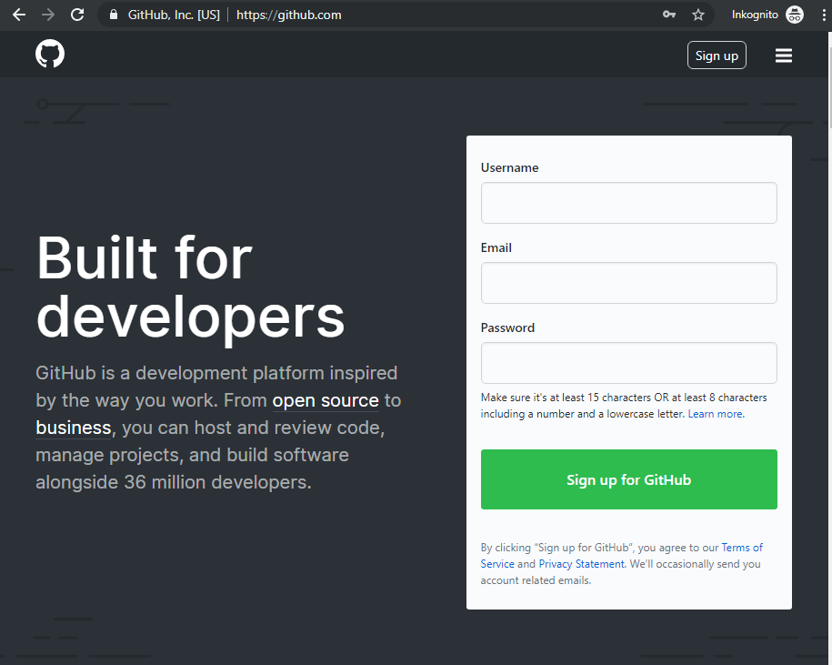
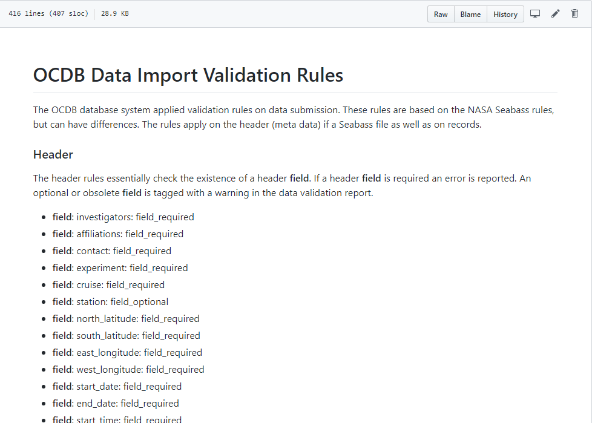
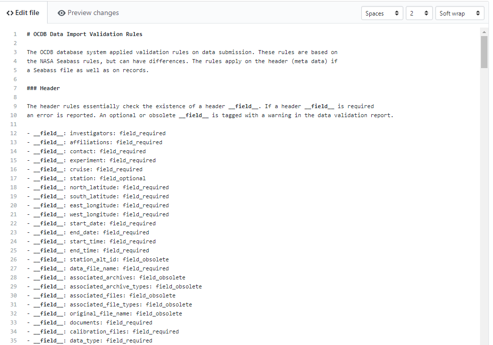
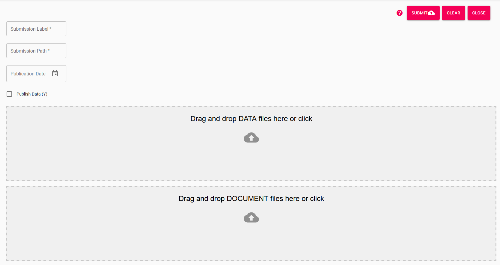
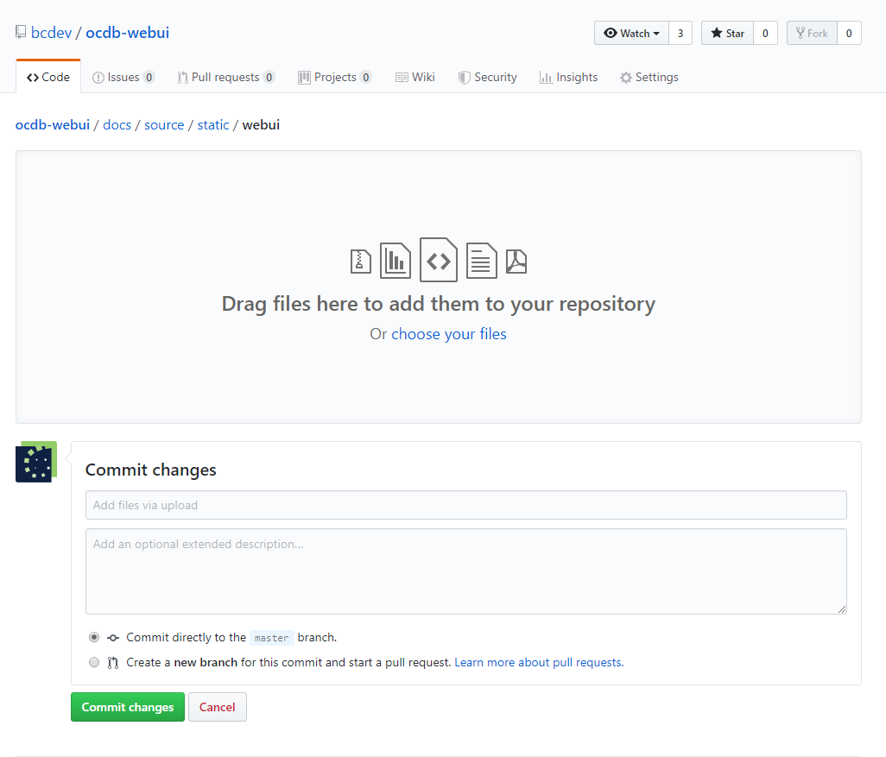

# Editing the Documentation

## Step 1: Get a GitHub Account

Go to [GitHub](https://github.com) and create an account for yourself. 
In future you will be able to use your internal BitBucket infrastructure
to do exactly the same.



## Step 2: Edit an md file

Go to the [OCDB docs](https://github.com) and click on an md file. On
the top right corner you find an edit button. Click it and an editor will 
open. 

The editor uses so-called markdown. Markdown documents are great for
these kinds of documents but have two issues: images and tables.





## A brief on Markdown

Markdown is a simple text file that is in this case translated into html.
The translator needs information about formattings like paragraphs, headers,
images etc. This is done by special characters. A hash (#) for instance
tells the translator  that a heading is following. The number of hashes 
you use notifies which level the heading is.

To gie an example:

```markdown
# Header 1
## Header2

- list item1
- list item2
  - list item 2.1
```

Translates into:

# Header 1
## Header2

- list item1
- list item2
  - list item 2.1

The easiest is to use this [cheat sheet](https://github.com/adam-p/markdown-here/wiki/Markdown-Cheatsheet)
or its [PDF version](https://guides.github.com/pdfs/markdown-cheatsheet-online.pdf)


## Code

Markdown is very string when highlighting source code. Start a 
paragraph using three single quotes (OBS: on the German keyboard
you have to use the upper apostroph key in the top row. That character
ONLY appears if its followed by pushing the space key. Drove me crazy!)

Example for python:

```python
import csv

with open('test.csv', 'r') as csv_file: 
    reader = csv.read(csv_file)
```

## Tables

Unfortunately readthedocs.io cannot parse markdown tables. You will have to use
rst tables instead. Use this tool for smaller tables: [Table Editor](https://truben.no/table/).

This tool will generate reStructured text which is very similar to markdown.
Include the text like this:

```rst_eval
+---------+---------+---------+
| header1 | header2 | header3 |
+=========+=========+=========+
| 1       | 1       | 1       |
+---------+---------+---------+
| 2       | 2       | 2       |
+---------+---------+---------+
| 3       | 3       | 3       |
+---------+---------+---------+
```

For larger tables you can import a csv file like this:

```eval_rst

.. csv-table:: The contents of 
   :widths: 15 40 20
   :header-rows: 1
   :file: ocdb_fields.csv
```

```eval_rst``` translates the reStructured text to markdown for you.


## Images and Links

Unfortunately there is no way to copy and paste images. You need to upload 
the first. Uploading files will be described in the following chapter. 
Including an image  

```markdown

```

Results in:


## Uploading Files

On the GitHub repository site, browse to the directory the file shall reside in
e.g.:

```
https://github.com/bcdev/ocdb-webui/tree/master/docs/source/static/webui 
```

Click on 'Upload files' in the rop right corner. Drag and drop you file(s)
into the dialog.

Add some documentation about the purpose of the file and click 'Commit Changes'.

If you use this file in the documentation please be aware that you 
have to refer to it from the docs/source directory as that is
where the documentation will be compiled when pushing to readthedocs.io.

The file submission_dialog.png for instance resides in ```docs/source/static/webui```
but will refered to as:

```markdown

```

