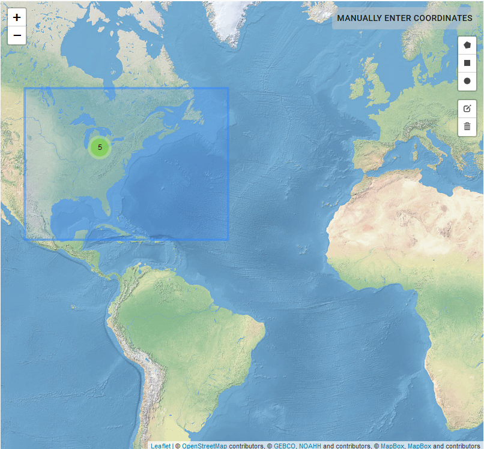
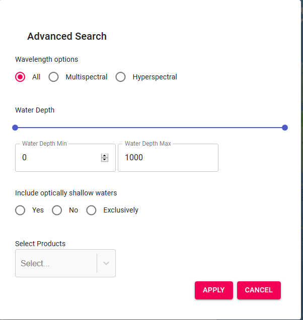
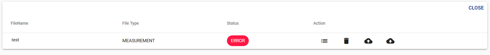

# User Manual for the OCDB WebUI

The main feature of the OCDB Database system is the stewardship of in-situ FRM data and data provision to the Ocean Colour community through an enhanced search facility. 

## Get Data: Search

The OCDB WebUI offers a _Search_ interface. 
Data can be searched by acquisition date, product groups and a _Search_ text field. 

In the _Search_ text field, users can enter any word(s) that will be used to screen the Database for any file containing that word(s). This field also allows the use of the so-called Lucene syntax which enables searches for specific field values and also allows chaining.

Please refer to the [__Search__](ocdb-search.md) chapter, for a complete list of product groups and more details about the Lucene search syntax.

Note that only those data which were elected for publication by their submitter, are available in searches. 

### Set region
Region for search can be set both either by entering coordinates by clicking on 'MANUALLY ENTER COORDINATES' button, or by drawing a polygon on the map.

### Advanced options

In advanced options menu, __single products__ can be selected (a list of standard names for variables is available [here](ocdb-standard-field-unit.md)). The wavelength option allows to filter __hyperspectral__ and __multispectral__ measurements. __Water depth__ threshold can also be set (when provided in metadata). Finally measurements taken in optically shallow waters can be either excluded or selected. 

### Save search
Any query can be saved for replicating the same search in the future (search options are saved, not the results!). Click on _SAVE SEARCH_ and assign a name to it. Search query can be edited and/or shared by clicking on _<>_ button.

## Contribute Data: Submissions

In this section data submission process is described.
Only registered users are allowed to submit data. Please contact ops@eumetsat.int to be registered. Registered users after logining in can manage new and past submission in the _Submit_ page.

### New Submission

To add a __new submission__, click on _NEW SUBMISSION_ on the top right corner.
A new dialog will open. Please add an identifier (_Submission Label_) for the submission and a path (_affiliation/experiment/cruise_)
where submission files will be stored under. The submission label will univocally refer to the submission, while submission path could be the same for multiple submissions.

Clicking on _Publish Data_ the user agrees to publish the data right after the submission and the quality check process. 
Selecting a date in _Publication Date_ will delay the publication of the data belonging to this submission. 
Data for which the publication is not agreed are ingested into the Database but accessible only to the Database administrators and the owner of the data. An agreement to publish can also be provided anytime in the future by contacting ops@eumetsat.int.

Drag and Copy or Select measurement files and documentation in the dedicated windows. File format and documentation required are described [here](ocdb-contribute.md).
Click on _SUBMIT_ to initiate the validation process.
Files containing measurements are immediately automatically checked according to [validation rules](ocdb-validation-config.md)
Click on _List Files_ available among _Actions_ tools to see the results of the validation, shown for each file.

In case of errors or warnings, for each file, click on _List Import Issues_  to show the list of error and warning messages.
Single files can be thus downloaded  and re-uploaded  and validated again.

In case of errors, the status of the submission is set to _SUBMITTED_. Submissions containing errors are not further procesed into the Database. If you need assistance, please contact ops@eumetsat.int indicating the identifier (_Submission label_) of the submission. 

If the validation succeeds, the status of the submission is set to _VALIDATED_ and further processed by Database administrators.

The picture below, summarises the whole process for submission and data validation.

### Submission Actions 
In _Submit_ page, any registered user, after login, can manage her/his own submissions and submission files.

Each submission is listed with its label, submission date, (if provided) publication date, publication agreement, submission status and available actions.

__List Files__: 

It shows a table of selected submission files. Actions are applicable for each file (see _Submission File Actions_ section below).

__Process Data__ (Admin users only):

Before they are processed, validated data are still not visible in the Database to anyone. __Process Data__ allows to start the processing action, at the end of which the data are searchable in the Database, but __ONLY__ to admin users and the owner of the data. 

__Publish Data__ (Admin users only):

With _Publish Data_ data are processed (if not processed yet) into the Database and the status of the data is set to __PUBLISHED__ and data are, therefore, searchable by the public in the Database. The publishing process checks whether the data has been already processed, to avoid data duplication.

__Delete Submission__ (Admin users only):

The whole submission is deleted, including processed/published data from the database.
 
__Halt Restart Submission__:

The user is able to halt a submission. This will denote the administrators that the user wishes that the submission is __NOT__ to be processed. Once the process is halted, a __Restart__ button will appear, and user can use it to comunicate submission can be now processed.

__Cancel Submission__ (Admin users only):

Cancelling the submission allows to delete the database entries linked to this submission, keeping submission files.
This data can be anytime re-processed into the Database from the _Submit_ page.

### Submission Status

Through the above actions, the following stati for submissions can be set

- __SUBMITTED__: submission contains errors and could not be validated
- __VALIDATED__: all submission files passed file format check (no errors, warnings allowed)
- __CANCELLED__: database entries linked to this submission have been canceled from the Database
- __PROCESSED__: submission data are searchable in the Database by submission owner and admin users
- __PUBLISHED__: submission data are searchable in the Database by anyone

Whenever a submission is updated, its status in the submission page is set again accordingly to _SUBMITTED_ or _VALIDATED_. 
On the other hand, files already published and searchable are not updated until the new/updtaed files are not processed by Database administrators, and the oldest version remains available in the meanwhile.

### Submission File Actions

When clicking on listing files, for a submission the data and document files are listed. This new table provides the following actions:

__List Import Issues__:

List issues the system encountered when validating the data file.

__Delete File__:

Remove the file from the submission.

__Download File__:

Download the file if a change to the submission file is required.

__Upload File__:

Re-upload a new version of the file. The old one is overwritten. The validation is re-run.

### Submission File Status

For each file, the fllowing stati can be set:

- __ERROR__: there are errors in the format of the file
- __WARNING__: there are warnings regarding the format of the file. 
- __VALIDATED__: the file passed the format quality check

