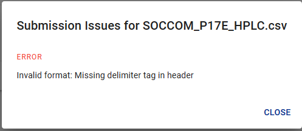
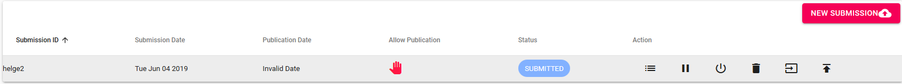

# User Manual for the OCDB WebUI

The aim of the __Copernicus Ocean Colour Database (OCDB)__ is to provide a platform to collect, organize and make available to ocean colour community ocean colour related _in-situ_ measurements, useful for satellite derived ocean colour products validation and algorithm development. 
This tool enables researchers to store in a organised Database their own _in-situ_ data, in a standard format (to guarantee interoperavility [Seabass data format](https://earthdata.nasa.gov/esdis/eso/standards-and-references/ascii-file-format-guidelines-for-earth-science-data/seabass-data-file-format) is used). 

The main features of the OCDB database system are the provision of the data to the research community with an enhanced search facility. 
__Quality check__ on format, measurements as well as on protocols complience is performed, and a quality flag is provided for each measurement. 
__Only when agreed__, _in-situ_ measurements are __published__ in the Database and made available to the public.  

Published, best quality data will be used to generate __Matchup files__ with Sentinel-3 Level 2 Ocean Colour OLCI A and B products.
In addition, when interested, registered users will be able to ask for the generation of matchup files Sentinel-3 Level 2 Ocean Colour OLCI A and B for their own submitted data.

## Search

Any data the submitter has agreed to publish is searchable for the public. 
The OCDB WebUI offers a _Search_ interface. 
Data can be searched by acquisition date, product groups (listed ) and a _Search_ text field.
In the text Users can enter a single keyword which will attempt to find data using the meta
data fields provided by the submitter. This field also allows to use the
so-called Lucene syntax which enables you to search for specific field values
and also allows chaining.

Please refer to the search chapter in OCDB Command Line Client and Python API section, for more details around the Lucene search syntax.

### Set region
Region for search can be set both either entering coordinates clicking on 'MANUALLY ENTER COORDINATES' button, or selecting a drawing a polygon on the map.

### Advanced options

In adavnced options menu, you can set wavelength options, water depth thresholds, whether to include or not measurements taken in optically shallow waters, and single products. 

### Save search
Any query can be saved by any user, for replicating the same search in the features (search otpions are saved, not the results!). Click on save and assign a name to it.

## Submissions

In this section we describe how to submit data. We assume that you have a user 
account and have logged in to the system. When clicking on the submission section a list of your submissions will appear including action buttons.

### New Submission

If you want to add a new submission click on New Submission on the top right corner.
A new dialog will open. Please add an identifier for your submission and a path
where submissions files will be stored under. This will be used to i

When submitting data, you will be asked to provide a publication date. Leave this empty if you do not desire your data to be searchible. Otherwise, indicate
what date you would like your data to be available to the public.

If you don't want the data to be published, tick 'publication' allowed. This 
will be shown in the submission table to the administrators.   

Once you initiate the submission by pushing "Submit" your data will be validated
using plausibility and validation rules (link to rules).

If the validation succeeds, the status of your submission will be VALIDATED 
otherwise SUBMITTED. If the system finds errors you can view them in the 
submission file table by clicking 'list files' on the submission table item. 

### Submission Actions

__List Submission Files__:

Views a table of submissions files and enables you to apply actions (see
chapter Submission File Actions). 

__Process Data__:

Until now, the data listed in the submission is not visible in the database.
The button __Process Data__ will start the processing action. When finished,
the data will be visible, burt __ONLY__ to the submitting user and admins. 

When pushing this button, the data will be processed into the database and, 
therefore, available for searching ONLY for administrators and the submittor.

__Publish Data__:

__Publish Data__ will do exactly the same as __Process Data__, but will set
the status of the data to __PUBLISHED__ and is, therefore, visible and
downloadable by the public. The publishing process will check whether the
data has been processed already to avoid data duplication. 

__Delete Submission__:

The whole submission will be deleted including processed/published data from the search database.

 
__Halt Restart Submission__:

The user is able to halt a submission. This will denote the administrators that the
user wished that the is __NOT__ to be processed. Once the process is halted, the user 
can a __Restart__ button will appear. 

__Cancel Submission__:

Cancelling the submission will delete the database entries linked to this submission.

### Submission Statuses

From the above actions the following statuses for submissions derive.

- Submitted
- Validated
- Cancelled
- Processed
- Published

### Submission File Actions

When clicking on listing files for a submission the data and document
files are listed. This new table provides the following actions:

__List Validation Issues__:

List issues the system encountered when validating the data file.

__Delete File__:

Remove the file from the submission.

__Download File__:

Download the file if a changed to the submission file is required.

__Upload File__:

Reupload a new version of the file. The old one will be overwritten. The 
validation will be re-run.

### Submission File Statuses

- ERROR
- VALIDATED
- WARNING

